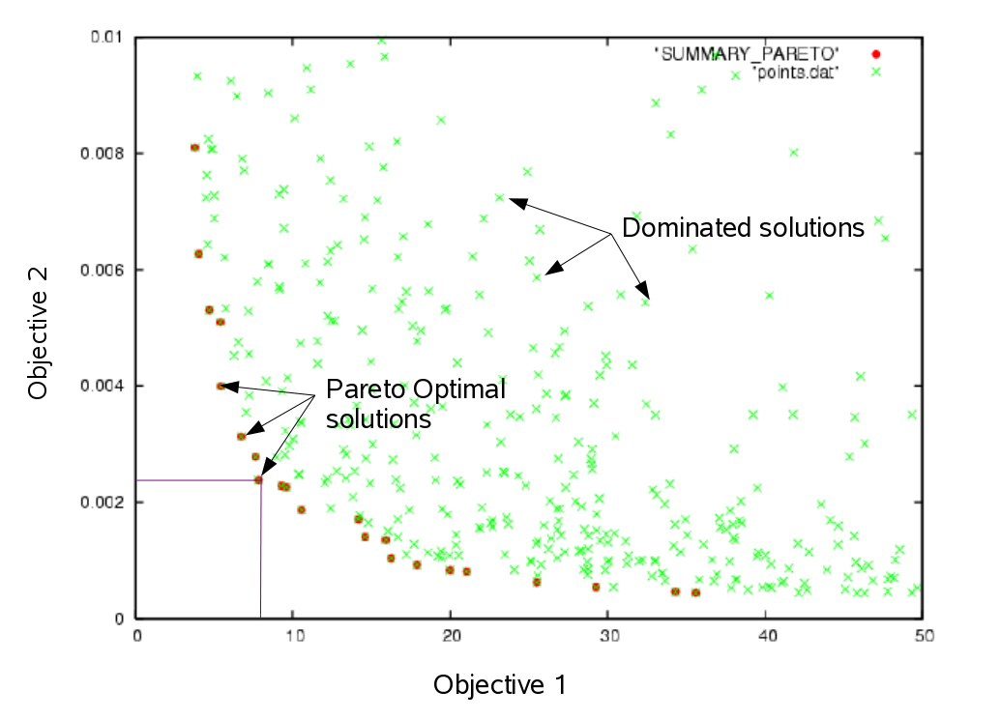

```{r setup, include=FALSE}
knitr::opts_chunk$set(echo = FALSE)
```

## MOP

Multiobjective Optimization Problem have multiple objective functions that must be optimized symultaneously.

Minimize(Maximize) $F(x) = (f_1(x), f_2(x), ..., f_n(x))$,

subject to $x$ in $\Omega$.

- $F(x)$ objective functions;
- $f_i$ is the i-th objective to be maximized;
- $x$ is the decision vector;
- $\Omega$ is the decision space.

## Pareto Set

Objectives may be conflicting!

- Set of solutions.

Set of *optimum solutions* - Pareto set.

- non-dominated solutions: no other solution providing a better trade-off in all objectives.

## Non-dominated solutions

1. Let $u = (u_1, ..., u_n)$ and $v = (v_1, ..., v_n)$ vectors in $\Omega$ (the decision space).
    - $u$ dominates $v$ if $u_i \leq v_i$, for every $i = 1,.., n$.

@. A point $x^*$ in $X$ is called *Pareto Optimal* if no other point dominates $x^*$. 
    - $\nexists F(x)$ that dominates $F(x^*)$

## Pareto Front

1. The set of all Pareto Optimal is called the *Pareto Set*. 
    - $P^*$ = {$x \in \Omega:\nexists y \in \Omega$ and $F(y) \geq F(x)$}
3. **Pareto Front** is the image of the Pareto Set in the objective space.
    - PF = {$F(x) = (f_i(x), ..., f_n(x)): x \in P^*$}

## Pareto Front


## MOEA/D

MOEA/D represents a class of population-based metaheuristics for solving MultiObjective Problems (MOPs).

- It is based on decomposition - one kind of scalaralizing function
  - One problem becames various single-objective subproblems.
  - Each subproblem is solved with a population of canditate solutions.
- A decomposition strategy generates weight vectors that defines the subproblems.

## Components of the MOEA/D

- Decomposition strategy: decomposes w/ weight vectors;
- Aggregation function:  weight vector => single-objective subproblems;
- **Neighborhood assignment strategy**: Relationship between subproblems;
- Variation Stack: New candidates solutions;
- Update Strategy: Maintain/discard canditate solutions;
- Constraint handling method: Constraint violation;
- Termination Criteria: when to stop the search.

## Cellular MOEA/D

MOEA/D can be viewed as a cellular algorithm - each cell has its own weight vector.

- The cells are located in the (n-1)-dimensional subspace -> satisfying the normalization condition:
    - $w_1 + ... + w_n = 1$ and $w_i \geq 0$ for i = 1, 2 ,...,n.
- Two neighborhood structures: 
    - Local selection.
    - Local replacement, both difined using the Euclidean distance between cells.

## Cellular MOEA/D

1. Initial population is randonly generated (as in standard cellular algorithms).
    1. If a generated solution id infeasible, apply a repaor procedure.
2. Fitness of a solutio is calculated at each cell using a scalarizing fitness function with the weight vector associated with that cell.
3. Parent solutions are randomly selected from the **selection neighbors**.
    3. Offspring is generated from the parents by crossover, mutation and/or repair.
4. Generated offspring is compared with the **replacement neighbors**, considering the weight vector.

OBS: The local selection and local replacement are performed for the next cell after they are completed for the current cell. 

